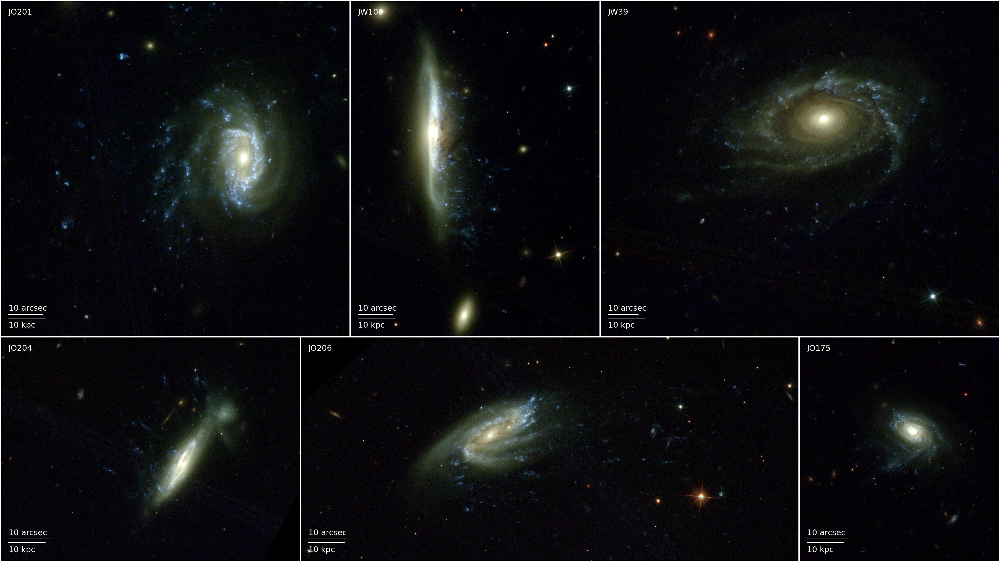
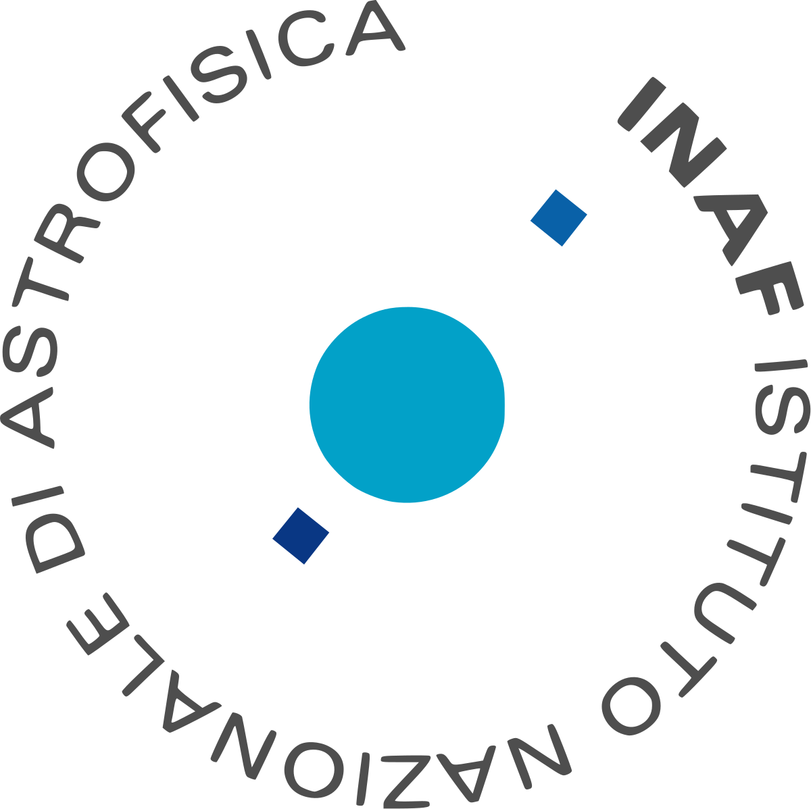
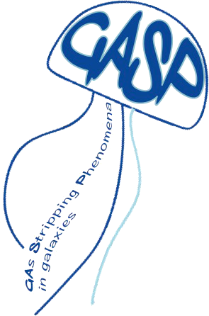

# About me

[My curriculum vitae](assets/doc/Eric_Giunchi_cv.pdf)\
First author publication [list](https://ui.adsabs.harvard.edu/user/libraries/Uz6wbuCZToGRY0qz7KLOJQ)\
Co-author publication [list](https://ui.adsabs.harvard.edu/user/libraries/ao3CZvuTRGOcxitKb5eikg)\
My ORCID: [0000-0002-3818-1746](https://orcid.org/0000-0002-3818-1746)

Hello there, I am Eric Giunchi, a PhD student in Astronomy at INAF-Osservatorio Astronomico di Padova, in Padua, Italy.\
My scientific work is mainly oriented to the study of **star formation**, focusing on very young stellar clumps observed in different environments. In order to do that, during my PhD program I studied a set of _HST/WFC3_ images of six galaxies undergoing strong **ram-pressure stripping** inside galaxy clusters, showing long tails of stellar clumps, of which we have studied the star-forming and morphological properties. The comparison of these clumps with those observed in "normal" galaxies can help unveiling which physical mechanisms drive the formation of new stars.

_Credits to Dr. Marco Gullieuszik_

My **scientific interests** include:
1. star-formation driving processes;
2. timescales of the different steps of star formation, from gas collapse to the decoupling of stars and gas;
3. galaxy evolution in peculiar enviroments like galaxy clusters;
4. evolution of groups and clusters of stars, either as a consequence of stellar evolution and dynamical interactions;
5. dwarf galaxies formation in galaxy clusters.

My work as a PhD student has been carried on under the supervision of Dr. Bianca Maria Poggianti, Dr. Marco Gullieuszik and Dr. Alessia Moretti as a part of **GASP** (_GAs Stripping Phenomena in galaxies with MUSE_, [Poggianti et al. 2017](https://iopscience.iop.org/article/10.3847/1538-4357/aa78ed)), an ESO Large Program that observed 114 galaxies with the MUSE Integral Field spectrograph on the VLT with the goal of clarifying how, where and when gas is removed from galaxies. The sample includes several galaxies that are undergoing ram-pressure stripping, some of which are textbook examples of **jellyfish** galaxies, while others have less prominent features. Further observations covered a wide range in wavelength, in order to characterize all the gas and stellar phases of these galaxies. That includes radio (ALMA, APEX, VLA, LOFAR, Meerkat), UV (UVIT), X-ray (Chandra, Astrosat) and high-resolution UV-optical data (HST). At the moment, the GASP collaboration counts more than [50 publications](https://web.oapd.inaf.it/gasp/publications.html).

   
