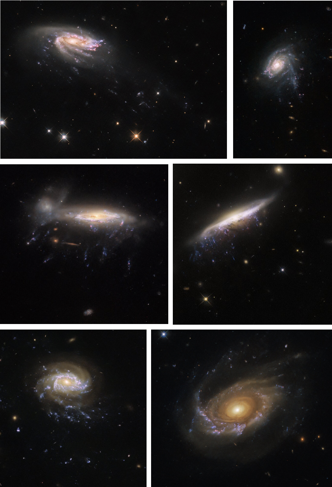

# I am Eric, nice to meet you!

<meta name="keywords" content="Eric Giunchi astronomer astronomy astrophysics HST Hubble Space Telescope galaxy clump cluster globular star formation stripping dynamics data reduction analysis">

[My curriculum vitae](assets/doc/Eric_Giunchi_cv.pdf)\
First author publication [list](https://ui.adsabs.harvard.edu/user/libraries/Uz6wbuCZToGRY0qz7KLOJQ)\
Co-author publication [list](https://ui.adsabs.harvard.edu/user/libraries/ao3CZvuTRGOcxitKb5eikg)\
My ORCID: [0000-0002-3818-1746](https://orcid.org/0000-0002-3818-1746)\
My [PhD thesis](https://www.research.unipd.it/handle/11577/3512294)\
My [Master thesis](https://amslaurea.unibo.it/21272/)

# About me
Hello there, I am Eric Giunchi, a Postdoctoral researcher at the University of Bologna since early 2024.
Previously, I got my PhD in Astronomy at the University of Padova, in collaboration with INAF-Osservatorio Astronomico di Padova, Italy, during the period going from late 2020 to early 2024.

# SCIENTIFIC SKILLS and BACKGROUND
I am currently working on the formation of **globular clusters**, focusing on the evolution of progenitor candidates at redshift 1.5-2 by means of state-of-art N-body simulations. In particular, I studied the evolution of the stellar clumps observed around the **Sparkler galaxy** (z=1.4), studying how dynamical friction and tidal shocks from the stellar disk can change their mass and size (and also, possibly, distrupt them).
During my PhD, my scientific work was mainly oriented to the study of **star formation**, focusing on very young stellar clumps observed in different environments. I developed a good knowledge about state-of-art observations and models regarding the properties and driving mechanisms of the **star-forming process** and **clump formation**, including turbulence, stellar feedback, dynamical and stellar evolution.
Theferore I developed expertise about the tracers and proxies of the properties of star-forming clumps, including **mass, luminosity** and size **distribution functions**; **luminosity, mass** and **SFR-size relations**; **morphological evolution**.
Strong focus on the variation of the properties of star-forming clumps across cosmic time and different environments (main-sequence galaxies, starburst galaxies, mergings, galaxies in clusters, intergalactic environments like spiral arms and inter-arm regions). In particular I studied the properties of stellar clumps formed from gas stripped from cluster galaxies undergoing strong **ram-pressure stripping**, surrounded by the hot, high-pressure intracluster medium.

For my Master thesis I developed a good background about **globular clusters formation** and **evolution**, both from the stellar and dynamical point of view (mass segregation, equipartition, influence of binaries and Intermediate Mass Black Holes, three-body interactions). In addition to that, I developed a good background about distribution functions for dynamical systems, including in particular **action-based distribution functions**, their properties and advantages.

# SCIENTIFIC INTERESTS
1. Formation and evolution of **stellar clumps**, whether they are star-forming or **globular clusters**;
2. **processes driving clump formation**, especially when involving gas dynamics like turbulent cascade and stellar feedback;
3. **star-formation process** as a whole, how the **environment** (at different scales, from the one surrounding the galaxy to the one surrounding the single clump) influences it and how this can be related to the evolution across cosmic time of scaling relations like the **galacitc SFR-stellar mass main sequence** and the **morphological evolution** of star-forming galaxies;
4. **galaxy evolution**, in particular from the dynamical point of view;
5. morphological evolution of galaxies, **clump survivability** and disruption timescales, dynamical and orbital **evolution of single stars**.

# Something about my research
I focused on the evolution of the old stellar clumps observed around the Sparkler galaxy, a lensed galaxy at z=1.4. In order to do that, we ran a set of simulations by means of the N-body code **Arepo** to study the effects of dynamical friction and tidal shocks on the stellar clumps. In particular, we studied different morphological configurations for the galaxy and the cluster system, the presence of a stellar disk and whether these processes shape the observed clusters into local globular clusters.

<video width="550" height="300" autoplay muted>
  <source src="assets/video/motions.mp4" type="video/mp4">
Your browser does not support the video tag.
</video>

_Simulation of the tidal shocks onto a stellar clump._

During my PhD program I studied a set of _HST/WFC3_ images of six galaxies undergoing strong **ram-pressure stripping** inside galaxy clusters, showing long tails of stellar clumps, of which we have studied the star-forming and morphological properties. The comparison of these clumps with those observed in "normal" galaxies can help unveiling which physical mechanisms drive the formation of new stars.

_Credits to Dr. Marco Gullieuszik._

In our works we study the global properties of the star-forming clumps observed in these peculiar objects, comparing clumps observed in the disk and the tails of these galaxies with each other and with clumps observed in main-sequence, isolated galaxies. The comparison has been carried on by looking at their distribution functions (mass, luminosity and size), the luminosity-size relation and the morphology. Our results suggest that ram pressure does not influence the turbulent cascade that drives gas collapse and star formation, but can locally enhance the star-formation rate surface density of the clumps.

My work as a PhD student has been carried on under the supervision of Dr. Bianca Maria Poggianti, Dr. Marco Gullieuszik and Dr. Alessia Moretti as a part of **GASP** (_GAs Stripping Phenomena in galaxies with MUSE_, [Poggianti et al. 2017](https://iopscience.iop.org/article/10.3847/1538-4357/aa78ed)), an ESO Large Program that observed 114 galaxies with the MUSE Integral Field spectrograph on the VLT with the goal of clarifying how, where and when gas is removed from galaxies. The sample includes several galaxies that are undergoing ram-pressure stripping, some of which are textbook examples of **jellyfish** galaxies, while others have less prominent features. Further observations covered a wide range in wavelength, in order to characterize all the gas and stellar phases of these galaxies. That includes radio (ALMA, APEX, VLA, LOFAR, Meerkat), UV (UVIT), X-ray (Chandra, Astrosat) and high-resolution UV-optical data (HST). At the moment, the GASP collaboration counts more than [50 publications](https://web.oapd.inaf.it/gasp/publications.html).

During my _Mater thesis_, I worked with Prof. Carlo Nipoti, Dr. Raffaele Pascale, Alessandro Della Croce and collaborators on the possible presence of **Intermediate Mass Black Holes** in the center of **globular clusters**. In order to do that, we used a set of action-based distribution functions to fit at the same time morphology and kinematics of single stars, having the possibility of varying the influence of the central black hole.

# Outreach experiences
As a part of my Bachelor degree, I worked as a guide for public visits at the Telescope of Loiano, Bologna (Italy). The guided visits included the description of the motion of stars and planets on the celestial sphere, some constellations and the basic properties of planets, stars and galaxies.

I also attended the _Notte dei Ricercatori_ ("Night of Researchers") 2023, giving a talk to a public of adults and high school students about how JWST is improving our science at high redshift. I also participate to a sieries of speed date, describing in a few minutes the daily life of an astronomer.

   
